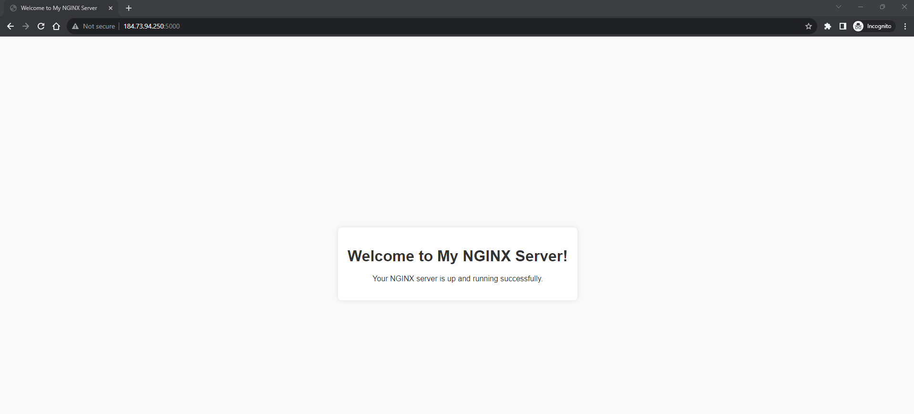

# Ansible Playbooks for NGINX Configuration and File Copy



This repository contains Ansible playbooks to perform two operations on a remote machine with an NGINX server:

1. Updating the NGINX configuration to listen on a different port.
2. Copying a local `index.html` file to the remote machine's web directory.

## Description

- **Update NGINX Configuration**:
  A playbook to find and replace the line `listen 80 default_server;` with `listen {{ portnumber }} default_server;` in the default NGINX configuration file at `/etc/nginx/sites-enabled/default`.
  - portnumber should be changed according to your need in the file.

- **Copy Local File to Remote Machine**:
  A playbook to copy a local `index.html` file from `/home/ubuntu/` to the `/var/www/html/` directory on the remote machine.
  - You can provide any index.html file to make the changes.

## Usage

1. Ensure Ansible is installed on your machine.
2. Update the `hosts` file with the hostname or IP address of your remote machine.
3. Run the following command to execute the playbooks:

```bash
ansible-playbook <PLAYBOOK FILE NAME>

